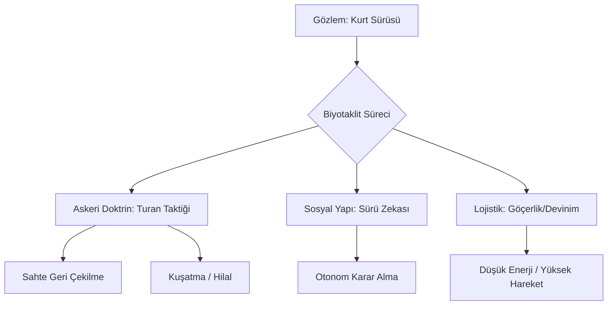

# 📂 01. Biyotaklit ve Etolojik Strateji (Behavioral Modeling)

Bu dizin, *Canis lupus* (kurt) türünün biyolojik ve sosyal davranışlarının, tarihsel Türk sistem düşüncesine ve askeri stratejilerine olan etkisini inceler.

## 🔬 Araştırma Konuları

### 🛠️ Sürekli Devinim (Nomadizm ve Optimizasyon)
Kurdun sabit bir alana hapsolmaması, kaynak yönetimi ve güvenlik için sürekli hareket halinde olması. Bu davranışın bozkır göçebeliğindeki lojistik karşılıkları incelenmektedir.

### 🧠 Dağıtık Sürü Zekası (Decentralized Swarm Intelligence)
Kurt sürülerindeki karar alma mekanizması, merkezi bir otoriteye (alfa) mutlak bağımlılık yerine, üyelerin otonom ve eşgüdümlü hareket etmesine dayanır. Modern sürü robotiği ve ağ topolojileri ile paralellikler kurulur.

### ⚔️ Asimetrik Harp ve Turan Taktiği
Bilinen adıyla "Kurt Kapanı" veya "Hilal Taktiği". Kurdun avını kuşatma, yorma ve bitirici hamleyi yapma mekaniğinin askeri doktrine aktarımı.

---

## 📈 Stratejik Model

---

## 📄 Alt Dosyalar
* [Turan Taktiği: Kurt Kapanı Mekaniği](turan-taktigi.md)
* [Sürü Zekası ve Dağıtık Sistemler](suru_zekasi.md)
