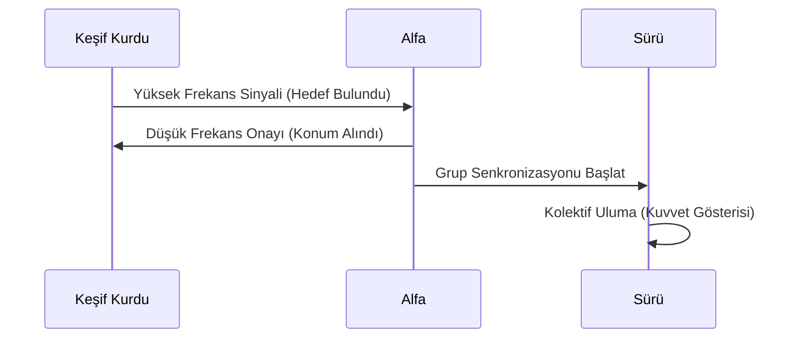

# 📡 İletişim Protokolleri: Uluma ve Veri İletişimi

Kurt sürülerinde iletişim, sadece bir ses çıkarma eylemi değil; mesafe, konum, av durumu ve sosyal hiyerarşi bilgilerini içeren karmaşık bir **protokol** yapısıdır.

## 🔊 Uluma Algoritmaları (Howling Protocols)

Bir kurdun uluması, insan kulağına tekdüze gelse de frekans modülasyonu ve süre ölçümleriyle yoğun bilgi taşır.

### 1. Konum Belirleme (Localizing)
Sürüden ayrılan bir birey, yüksek frekanslı bir "arayış" uluması başlatır. Diğer bireyler bu sinyale "yankı" protokolü ile cevap vererek sürünün koordinatlarını iletir.

### 2. Sınır Güvenliği (Firewall Howling)
Başka bir sürünün yaklaştığı fark edildiğinde, tüm sürü (koroyu andıran bir biçimde) senkronize ulumaya başlar. Bu, karşı tarafa "alan dolu" mesajını veren biyolojik bir **reddetme (denial)** sinyalidir.

## 📊 Veri Akış Modeli

## 🐾 Vücut Dili: Yakın Mesafe Paketleri

Ulumanın sesli (long-distance) versiyonunun aksine, yakın mesafede kulak hareketleri ve kuyruk pozisyonları **ikili (binary)** durumları temsil eder:

*   **Alpha Status:** Dik kuyruk, ileri kulaklar (Bit 1).
*   **Submissive Status:** Düşük kuyruk, geri kulaklar (Bit 0).

---
*Referans: Ethology: The Biology of Behavior, Irenäus Eibl-Eibesfeldt*
