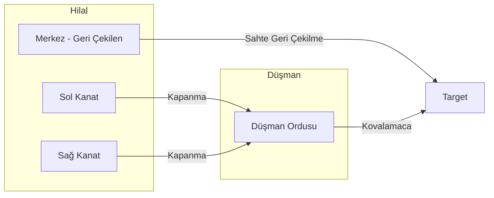

# 🐺 Turan Taktiği: Kurt Kapanı Mekaniği

Turan Taktiği (Hilal Taktiği veya Kurt Kapanı), tarihteki en başarılı asimetrik harp yöntemlerinden biridir. Bu taktiğin kökeni, kurtların vahşi doğada avlarını nasıl kuşattıkları ve etkisiz hale getirdiklerine dair yapılan binlerce yıllık gözleme dayanır.

## 🏹 Taktiğin Fazları

### 1. Keşif ve Tahrik (Provokasyon)
Kurtların sürü dışındaki hedefi belirlemesi ve ona yaklaşarak tepkisini ölçmesi gibi, merkez kuvvetler düşmana saldırır ve onları kendi üzerine çeker.

### 2. Sahte Geri Çekilme (Tuluğ)
Bu aşama, biyomimetik bir aldatmacadır. Kurtların "yaralı" veya "zayıf" görünerek avı peşine takması gibi, merkez kuvvetler panik içindeymişçesine geri çekilir.

### 3. Pusu ve Kuşatma (Kapan)
Düşman ordusu içeri çekildiğinde, kanatlarda gizlenen süvari birlikleri (hilalin uçları) hızla kapanarak düşmanı bir çember içine alır.

## 📊 Biyotaklit Karşılaştırması

| Özellik | Canis Lupus (Kurt) | Turan Taktiği |
| :--- | :--- | :--- |
| **İletişim** | Uluma ve Vücut Dili | Tampurlar ve Islıklı Oklar |
| **Roller** | Sürücü ve Bitirici Kurtlar | Merkez ve Kanat Birlikleri |
| **Enerji Yönetimi** | Avı Uzun Süre Takip Etme ve Yorma | Hareketli Süvari Barlığı |
| **Sonuç** | Çember Altında Bitirici Hamle | Tam Kuşatma ve İmha |

## 📐 Geometrik Modelleme

---
*Referans: Türk Mitolojisi ve Bozkır Kültürü Arşivi*
