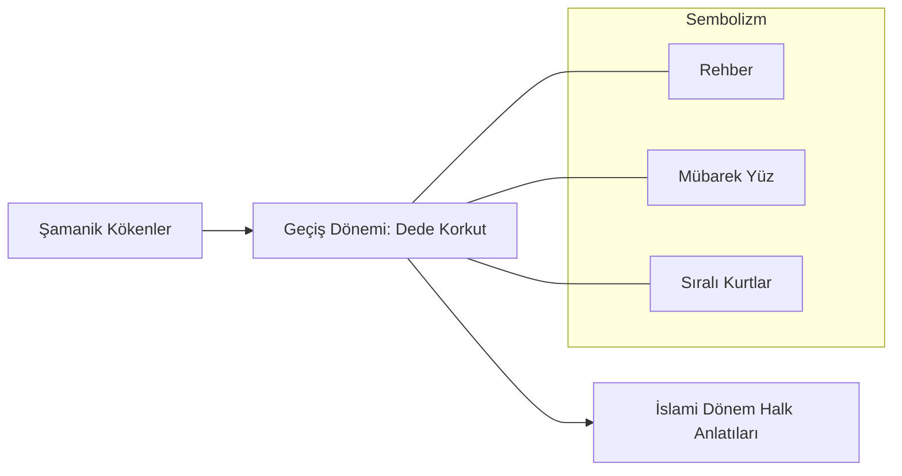

# 📂 02. Dede Korkut Anlatıları ve Epik Gelenek (The Oghuz Epics)

Bu dizin, Türk edebiyatının ve sözlü kültürünün en önemli eserlerinden biri olan **Dede Korkut Kitabı**'nda kurdun nasıl sembolize edildiğini ve ontolojik konumunu inceler.

## 📖 Tematik Başlıklar

### ✨ "Kurt Yüzü Mübarektir"
Dede Korkut hikayelerinde geçen bu ifade, kurdun sadece bir hayvan değil, ilahi bir kut (şans/güç) taşıyıcısı olduğunun kanıtıdır. Hikayelerde kahramanlar darda kaldıklarında veya düşmana karşı harekete geçtiklerinde kurdu bir rehber ve sırdaş olarak görürler.

### 🤝 Kahraman ve Kurt Diyaloğu
Salur Kazan'ın evinin yağmalanması üzerine kurtla dertleşmesi, insan ve doğa arasındaki kopmaz bağı gösterir. Kurt, insanın doğadan kopuk bir varlık olmadığını, aksine onun bir parçası ve koruyucusu olduğunu temsil eder.

### 🛡️ Sadakat ve Koruyuculuk
Oğuz anlatılarında kurt, sadakatin en üst mertebesini temsil eder. Sürüye olan bağlılığı, boya olan bağlılıkla özdeşleştirilir.

---

## 🏛️ Edebi Analiz

---

## 📄 Alt Dosyalar
* [Kurt Yüzü Mübarektir: Ontolojik Kökenler](kurt-yuzu-mubarektir.md)
* [Salur Kazan ve Kurtla Söyleşme](salur-kazan-diyalog.md)
