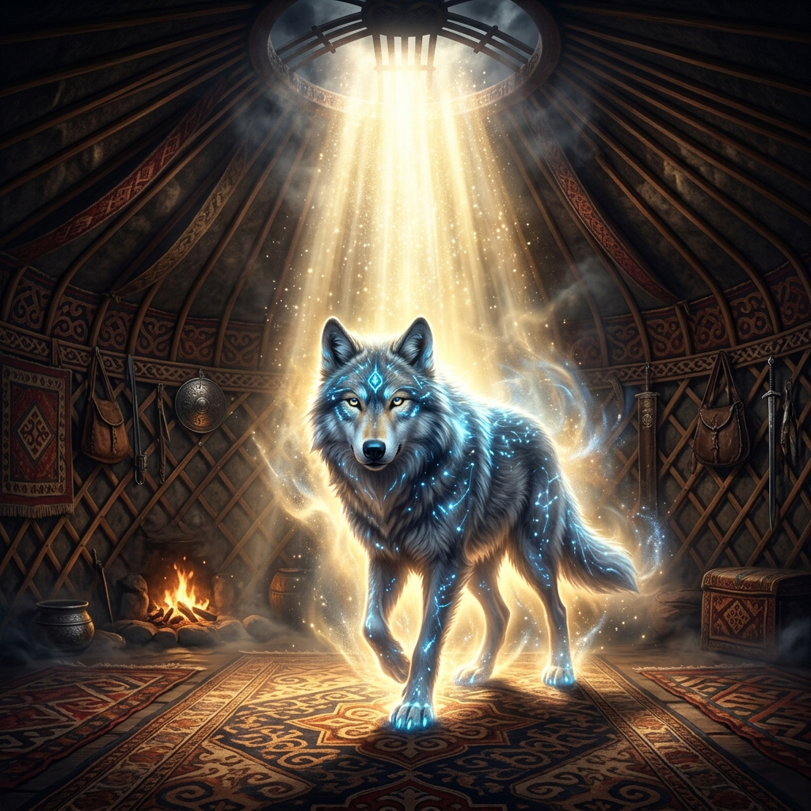

# 📂 03. Türeyiş ve Ontoloji (Kökler)

Bu dizin, Türk boylarının köken anlatılarında kurdun "ata" ve "kurtarıcı" rolünü tarihsel veriler ışığında inceler.

## 🏺 Araştırma Alanları

### 🛡️ Aşina (A-shih-na) Boyu
Göktürk Kağanlığı'nı kuran hanedan sülalesi olan Aşina boyu, soylarının bir dişi kurttan türediğine inanır. Çin kaynaklarında (Zhou-shu) detaylandırılan bu efsane, bir milletin küllerinden yeniden doğuşunu sembolize eder.

### 🧭 Ergenekon Algoritması ve Oğuz Kağan Rehberliği
Ergenekon Destanı'nda kurt, sadece bir sembol değil, sarp dağlar arasında sıkışmış bir topluluğu demir dağı eriterek düzlüğe çıkaran bir "navigasyon" ve "strateji" rehberidir. Oğuz Kağan Destanı'nda ise ilahi bir ışıktan çıkarak orduya yol gösterir.

---

## 📄 Alt Dosyalar
* [Aşina Boyu ve Ergenekon Algoritması](asina-boyu.md)
* [Işık ve Rehber: Gökbörü (Oğuz Kağan Destanı)](oguz-kagan-rehberligi.md)

# 📂 04. Semiyoloji ve İkonografi

Bu dizin, kurdun maddi kültürdeki (sancaklar, tuğlar, kaya resimleri) yansımalarını inceler.

## 🚩 Altın Kurt Başlı Tuğlar
Göktürklerde kağanlık alameti olan altın kurt başlı sancaklar, egemenliğin ve askeri disiplinin en somut göstergesidir. Kurganlardan çıkan bu objeler, kurdun devlet hiyerarşisindeki yerini kanıtlar.

## 🎨 Petroglifler ve Epigrafi
Avrasya steplerindeki kaya resimlerinde kurdun stilize edilmiş formları, sanat tarihçileri için önemli bir veri kaynağıdır.
