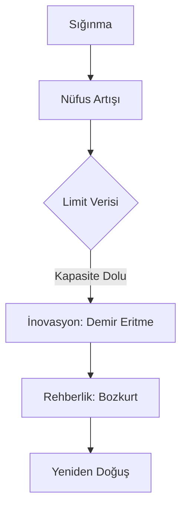

# 🛡️ Aşina Boyu ve Ergenekon Algoritması

## 🏺 Aşina (A-shih-na) Boyu: Soyun Kökeni
Aşina boyu, Göktürk Kağanlığı'nın (552-745) kurucu hanedanıdır. Tarihsel kaynaklara göre bu hanedan, büyük bir katliamdan kurtulan tek bir çocuğun dişi bir kurt tarafından emzirilip büyütülmesiyle başlar.

*   **Genetik Miras:** Kurt sadece bir ata değil, hanedanın meşruiyet kaynağıdır.
*   **Aşina İsmi:** Bazı filologlara göre bu isim "Gök" veya "Kurt" ile ilişkilendirilmektedir.

## 🧭 Ergenekon Algoritması: Bir Çıkış Stratejisi
Ergenekon Destanı, bir topluluğun hayatta kalma ve büyüme sürecini matematiksel bir modelleme gibi sunar:

1.  **İzolasyon (Sığınma):** Dış tehditlere karşı korunaklı, kaynakları bol bir alana (Ergenekon) yerleşme.
2.  **Büyüme (Skalabilirlik):** Yüzyıllar boyunca nüfusun ve gücün artması.
3.  **Sorun (Limit):** Alanın artık yetmemesi (kaynak sınırına ulaşma).
4.  **Çözüm (İnovasyon):** Demir dağı eritme (teknolojik aşama).
5.  **Rehberlik (Navigasyon):** Bozkurt'un liderliğinde yeni dünyaya açılma.

---
*Referans: Jean-Paul Roux, Türklerin Tarihi*
