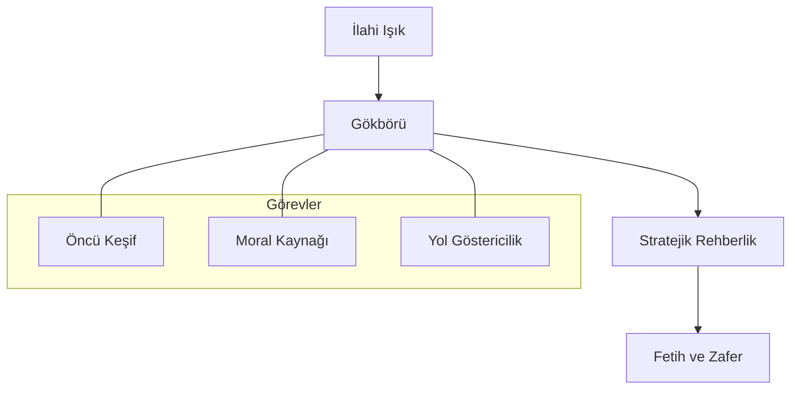

# 👼 Işık ve Rehber: Gökbörü (Oğuz Kağan Destanı)

Oğuz Kağan Destanı'nda kurt, sadece bir ata değil, ilahi bir iradenin (Tengri) yeryüzündeki tecellisi ve orduların mutlak rehberidir.

## 🌟 Işıktan Gelen Müjde

Destana göre, Oğuz Kağan ordularıyla birlikte sefere çıkmaya hazırlanırken otağına güneş gibi bir ışık girer. Bu ışığın içinden, "gök yeleli, gök tüylü" bir erkek kurt çıkar.

> *"Ben sana önden yol göstereceğim, beni takip et!"*

### 🛸 Biyotaklit ve Navigasyon
Mitolojik bir anlatı olsa da, kurdun ordunun önünde gitmesi, bir öncü kıtanın (scout) stratejik önemini vurgular. Kurt, coğrafi engelleri ve düşman tuzaklarını önceden sezerek orduyu güvenli yollardan geçirir.

## 🧩 Sembolik Özellikler

*   **Renk (Gök):** Gök rengi (mavi/gri), kutsallığı ve gökyüzüyle olan bağı temsil eder. Bu nedenle "Gökbörü" ismi yücelik nişanesidir.
*   **Erkeklik ve Güç:** Ergenekon'daki dişi kurdun (koruyucu/besleyici) aksine, Oğuz Kağan Destanı'ndaki kurt "erkek" ve "savaşçıdır" (fatih).

## 📊 Fonksiyonel Model

---
*Referans: Bahaeddin Ögel, Türk Mitolojisi (Cilt I)*
