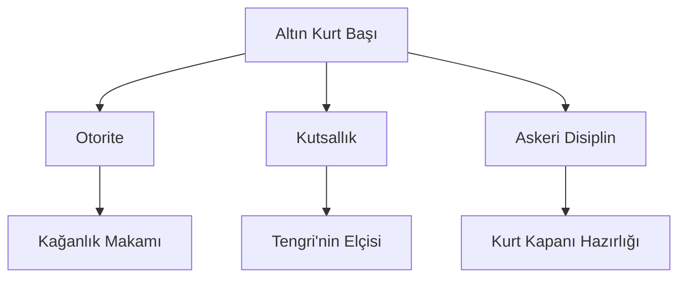

# 📂 04. Semiyoloji ve İkonografi

Bu dizin, kurdun maddi kültürdeki ve görsel sanatlardaki izlerini analiz eder.

## 📄 README

*   [Altın Kurt Başlı Tuğlar ve Sancaklar](tuglar-ve-sancaklar.md)
*   [Nümismatik ve Mühürlerde Kurt](paralar-ve-muhurler.md)
*   **Petroglifler:** Kaya resimlerindeki kurt tasvirleri.

## 🚩 Altın Kurt Başlı Tuğlar ve Sancaklar

Tarihsel Türk devletlerinde (özellikle Göktürklerde), kağanlık otağının önüne dikilen tuğların tepesinde altından dökülmüş bir kurt başı bulunurdu. Bu, sıradan bir süsleme değil, mutlak otoritenin ve ordunun kurda olan bağlılığının sembolüydü.

## 🎨 Maddi Kültür Örnekleri

| Öğe | Buluntu Alanı | Dönem |
| :--- | :--- | :--- |
| **Altın Kurt Başı** | Ötüken / Orhun bölgesi | Göktürk (6. - 8. YY) |
| **Kaya Resimleri** | Saymalıtaş / Kırgızistan | Tunç Çağı - Erken Demir |
| **Kurtlu Kemer Tokaları** | İskit / Hun Kurganları | M.Ö. 4. YY - M.S. 2. YY |

---
*Referans: Bahaeddin Ögel, Türk Mitolojisi*
