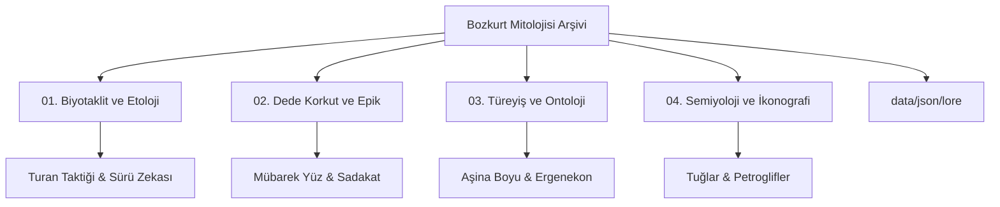
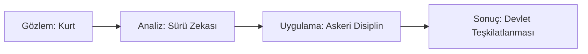

# 🐺 Bozkurt Mitolojisi: Biyotaklit, Hareket Felsefesi ve Kurt Sembolizmi Arşivi


[](https://creativecommons.org/licenses/by-nc-sa/4.0/)
[]()
[]()
[]()

> *"Yukarıda mavi gök, aşağıda yağız yer yaratıldığında, ikisinin arasında insan oğlu yaratılmış... O zamanlar Tanrı güç verdiği için, babam kağanın ordusu kurt gibi imiş, düşmanları koyun gibi imiş."* – *Orhun Yazıtları (Kül Tigin Anıtı)*

Bu arşiv; Orta Asya bozkır kültürünün temel taşı olan **Kurt (Böri / Aşina)** figürünü, antropolojik bir mit olmanın ötesinde, erken dönem bir **biyotaklit (biomimicry)**, sistem modellemesi ve epik gelenek vakası olarak incelemeye adanmış disiplinlerarası bir referans kütüphanesidir.

---

## 👁️ Manifesto: Gözlem, Taklit ve Epik Süreklilik

Bozkurt, göçebe bozkır medeniyetlerinde romantik bir efsaneden ziyade, uzun süreli ampirik gözlemlerin sonucunda elde edilmiş kusursuz bir optimizasyon modelidir. Kadim Türkler, zorlu coğrafi koşullarda hayatta kalabilmek için kurdun doğasını izlemiş, analiz etmiş ve onun davranışsal algoritmalarını kendi sosyolojik, askeri ve iletişim ağlarına entegre etmiştir.

---

## 🔬 Araştırma Metodolojisi

Bu proje, veriye dayalı bir analiz yaklaşımını benimser:
1.  **Etolojik Analiz**: *Canis lupus* türünün sosyal hiyerarşisi, avlanma stratejileri ve enerji yönetimi incelenir.
2.  **Mitolojik Tersine Mühendislik**: Destanlardaki "mucizevi" olaylar, stratejik ve lojistik karar alma süreçleri olarak yeniden yorumlanır (Örn: Ergenekon'un bir skalabilirlik problemi olarak ele alınması).
3.  **Semiyotik Çözümleme**: Maddi kültür varlıklarının (tuğlar, sikkeler) taşıdığı sembolik mesajlar deşifre edilir.

---

## 🧭 Depo Mimarisi ve Gezinti



### 📂 [01. Biyotaklit ve Etolojik Strateji](01-biyotaklit-ve-etolojik-strateji/)
*   **Sürekli Devinim:** Nomadizm ve optimizasyon.
*   **Sürü Zekası:** Dağıtık iletişim ağları.
*   **Asimetrik Harp:** Turan Taktiği mekaniği.
*   **İletişim Protokolleri:** Uluma algoritmaları ve veri iletimi.

### 📂 [02. Dede Korkut Anlatıları ve Epik Gelenek](02-dede-korkut-anlatilari/)
*   **Kurt Yüzü Mübarektir:** Ontolojik kökenler.
*   **Kurtla Söyleşme:** Salur Kazan'ın doğayla kurduğu derin bağ.
*   **Toplumsal Hafıza:** Şamanik mirasın edebi dönüşümü.

### 📂 [03. Türeyiş ve Ontoloji](03-tureyis-ve-ontoloji/)
*   **Aşina Boyu:** Göktürk hanedanının genetik ve mitolojik kökleri.
*   **Ergenekon:** Bir topluluğun yeniden doğuş algoritması.
*   **Gökbörü:** Oğuz Kağan'ın ilahi ve stratejik rehberi.

### 📂 [04. Semiyoloji ve İkonografi](04-semiyoloji-ve-ikonografi/)
*   **Altın Kurt Başlı Tuğlar:** Devlet otoritesinin görsel dili.
*   **Nümismatik:** Para ve mühürlerde kurdun sürekliliği.
*   **Petroglifler:** Avrasya steplerindeki görsel hafıza.

### 📂 [05. Kurt Dili (ULUYI) ve Simülasyon](05-kurt-dili-ve-simulasyon/)
*   **ULUYI Scripting:** Kurt sürüsü davranışlarını tanımlayan egzotik dil.
*   **Sürü Zekası Simülasyonu:** Kadim stratejilerin algoritmik temsili.
*   **Interpreter:** .uluy dosyalarını işleyen düşük seviyeli motor.

---

## 📖 Börülük Sözlüğü (Glossary)

*   **Böri / Börü**: Eski Türkçede "kurt". Aynı zamanda Göktürklerde hanedan muhafızlarına verilen isim.
*   **Gökbörü (Kök-Börü)**: Gök rengi/yeleli kutsal kurt. İlahi rehberliği temsil eder.
*   **Aşina (Asena)**: Göktürk hanedanının türediğine inanılan dişi kurt; soyun koruyucusu.
*   **Kurt-Ata**: Kavimlerin koruyucu ve yaratıcı gücü olarak kurdu simgeleyen ontolojik terim.
*   **Turan Taktiği**: Kurtların avlanma biçiminden ilham alan askeri "Hilal/Kuşatma" stratejisi.

---

## 🖼️ Görsel Galeri ve Belgeleme

### Gökbörü Rehberliği (Destan Tasviri)

*Oğuz Kağan'ın otağına giren ilahi ışığın içinden çıkan rehber kurt tasviri.*

### Stratejik Modelleme


---

## ⚙️ Geliştiriciler İçin: Data API

Veri setlerimiz [JSON Schema](data/json/schema.json) standartlarına uygundur.

```json
{
  "entity_id": "OK-001",
  "kavram": "Gökbörü",
  "kaynak": "Oğuz Kağan Destanı",
  "analiz": "Işık içerisinden çıkan ilahi rehber."
}
```

---

## ✨ Vecizeler ve Atasözleri

> *"Kurt kışı geçirir ama yediği ayazı unutmaz."* – Türk Atasözü

> *"Kurt, yalnız olduğu için mi ulur? Yoksa uluduğu için mi yalnızdır?"* – Ahmet Hamdi Tanpınar

---

## 🚀 Yol Haritası (Roadmap)

- [x] **Interactive Dashboard**: Veri havuzunu ve stratejileri görselleştiren web arayüzü.
- [x] **ULUYI Language Evolution**: Enerji ve strateji (Turan) mantığı eklenen egzotik dil.
- [x] **Simulation 2.0**: Gelişmiş ASCII simülasyonu ve stratejik avlanma.
- [x] **Dataset Expansion**: Ergenekon ve Türeyiş destanlarının JSON entegrasyonu.
- [ ] **Mobile App**: Arşiv verilerine erişim sağlayan mobil uygulama konsepti.

---

## 📄 Lisans Bildirimi

Bu arşiv **CC BY-NC-SA 4.0** lisansı ile korunmaktadır.

<br>
<p align="center">
  <b>"Böri tegi erdemlik"</b><br>
  <i>(Kurt gibi erdemli / otonom ve kararlı)</i><br>
  Hareket et, gözlemle ve sistemi yönet.
</p>