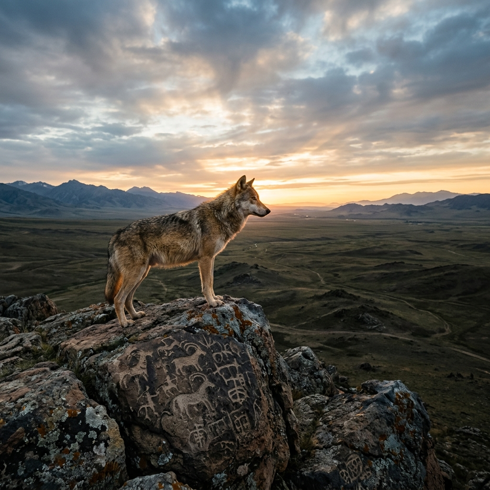
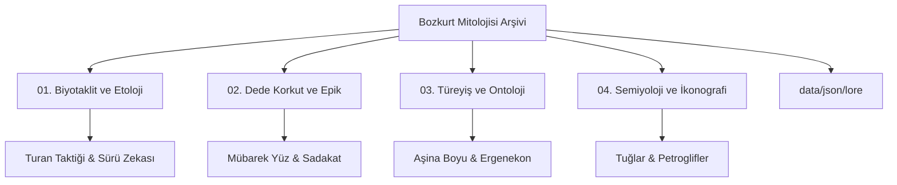

# 🐺 Bozkurt Mitolojisi: Biyotaklit, Hareket Felsefesi ve Kurt Sembolizmi Arşivi



[](https://creativecommons.org/licenses/by-nc-sa/4.0/)
[]()
[]()
[]()

> *"Yukarıda mavi gök, aşağıda yağız yer yaratıldığında, ikisinin arasında insan oğlu yaratılmış... O zamanlar Tanrı güç verdiği için, babam kağanın ordusu kurt gibi imiş, düşmanları koyun gibi imiş."* – *Orhun Yazıtları (Kül Tigin Anıtı)*

Bu arşiv; Orta Asya bozkır kültürünün temel taşı olan **Kurt (Böri / Aşina)** figürünü, antropolojik bir mit olmanın ötesinde, erken dönem bir **biyotaklit (biomimicry)**, sistem modellemesi ve epik gelenek vakası olarak incelemeye adanmış disiplinlerarası bir referans kütüphanesidir.

## 🧭 Depo Mimarisi ve Gezinti

Aşağıdaki diyagram, arşivin disiplinlerarası yapısını ve klasör hiyerarşisini göstermektedir:



### 📂 [01. Biyotaklit ve Etolojik Strateji](01-biyotaklit-ve-etolojik-strateji/)
*   **Sürekli Devinim:** Nomadizm ve optimizasyon.
*   **Sürü Zekası:** Dağıtık iletişim ağları.
*   **Asimetrik Harp:** Turan Taktiği mekaniği.
*   **İletişim Protokolleri:** Uluma algoritmaları.

### 📂 [02. Dede Korkut Anlatıları ve Epik Gelenek](02-dede-korkut-anlatilari/)
*   **Kurt Yüzü Mübarektir:** Ontolojik kökenler.
*   **Kurtla Söyleşme:** Salur Kazan diyaloğu.
*   **Toplumsal Hafıza:** Şamanik miras.

### 📂 [03. Türeyiş ve Ontoloji](03-tureyis-ve-ontoloji/)
*   **Aşina Boyu:** Göktürk hanedan izleri.
*   **Ergenekon:** Coğrafi yön bulma algoritmaları.
*   **Gökbörü:** Oğuz Kağan'ın ilahi rehberi.

### 📂 [04. Semiyoloji ve İkonografi](04-semiyoloji-ve-ikonografi/)
*   **Altın Kurt Başlı Tuğlar:** Otorite sembolleri.
*   **Petroglifler:** Kaya resimlerinde evrim.
*   **Nümismatik:** Para ve mühürlerde kurt.

---

## 💻 Kurulum ve Kullanım

Depoyu kendi yerel ortamınıza klonlamak ve veri setlerini incelemek için:

```bash
git clone https://github.com/arch-yunus/bozkurt-mitolojisi.git
cd bozkurt-mitolojisi
```

### ⚙️ Geliştiriciler İçin: Böri Veri Seti (Data API)

Makine öğrenimi modelleri ve strateji oyunları geliştiren mühendisler için `/data/json/` dizininde kurdun taktiksel ve mitolojik formları standardize edilmiştir. Veriler [JSON Schema](data/json/schema.json) ile doğrulanabilir.

**Örnek Şema (`data/json/lore/oguz_kagan_wolf.json`):**
```json
{
  "entity_id": "OK-001",
  "kavram": "Gökbörü",
  "kaynak": "Oğuz Kağan Destanı",
  "analiz": "Işık içerisinden çıkan ilahi rehber."
}
```

---

## 🚀 Katkı Sağlama Standartları

Bu proje, akademik titizliğe ve veri doğruluğuna dayanan açık bir inisiyatiftir.

1.  **Kanıta Dayalı Eklemeler:** Her bilgi girişi akademik bir yayına dayanmalıdır.
2.  **Objektif Analiz:** Etolojik, antropolojik ve filolojik bir dil kullanılmalıdır.

---

## 📄 Lisans Bildirimi

Bu yapı, bilginin serbest dolaşımını teşvik etmek amacıyla **Creative Commons Attribution-NonCommercial-ShareAlike 4.0 International (CC BY-NC-SA 4.0)** lisansı ile sunulmuştur.

<br>
<p align="center">
  <b>"Böri tegi erdemlik"</b><br>
  <i>(Kurt gibi erdemli / otonom ve kararlı)</i><br>
  Hareket et, gözlemle ve sistemi yönet.
</p>